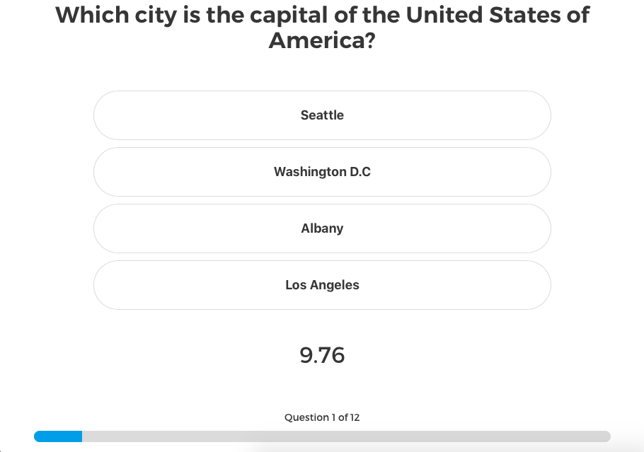

Bulvia
=========

An easy to play Trivia game powered by Open Trivia, showcasing bulma.io.

Bulvia is a web app developed using [Vue](https://vuejs.org) powered by the [Open Trivia Database](https://opentdb.com/). [Vuex](https://github.com/vuejs/vuex) has been used to manage the state of the app and http requests are handled with [vue-resource](https://github.com/pagekit/vue-resource).

# Contribute

- `yarn dev` fires up the webpack dev server
- `yarn lint` because everybody loves linted code
- `yarn build` builds and optimizes the app for production
- `yarn deploy:gh-pages` deploys the built app to GitHub Pages

# Features

- [x] Multiplayer
- [ ] Categories
- [ ] More animation
- [x] Mobile friendly
- [x] Nickname (for both players)
- [ ] Better score system
- [ ] Custom matches length
- [x] Leaders board saved on local storage
- [x] Random quotes about design in Game Over panel
- [ ] Instructions initial screen

# Links

- [bulma.io](https://bulma.io)
- [buefy](https://buefy.github.io)

# About

[@mattmezza](https://matteo.merola.co)
